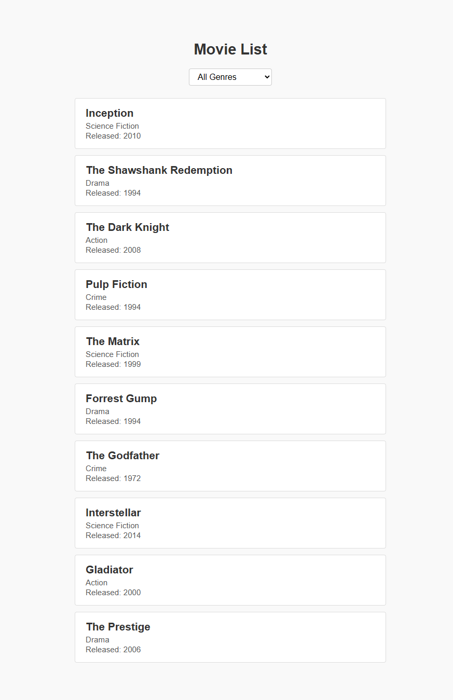
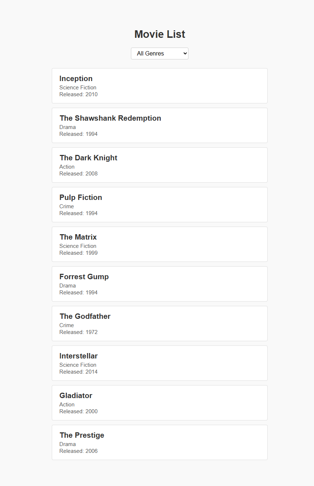
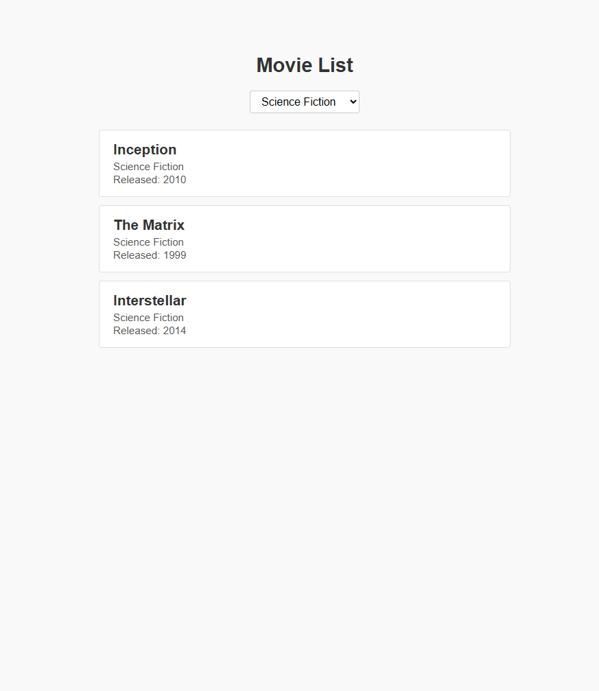

# PE02 - Movie List React Application

## CS628 - Programming Exercise 02

---

# Input

The application receives two types of user input. First, a predefined array of movie objects is loaded internally, where each object contains a title, genre, and release year. Second, the user interacts with the application through a genre dropdown selector, choosing either "All Genres" or a specific genre such as Science Fiction, Drama, Action, or Crime. Additionally, users can click on any movie card, which triggers a click event input captured by the application.

# Process

The MovieList component processes the data using React hooks. The `useState` hook manages the selected genre state. When the user selects a genre from the dropdown, the `handleGenreChange` function updates the state. The component then filters the movie array using JavaScript's `filter()` method, comparing each movie's genre against the selected value. Unique genres are extracted dynamically using `Set` and the spread operator. When a movie card is clicked, the `handleMovieClick` function processes the event and calls the browser's `alert()` function. The MovieCard child component receives movie data and the click handler via props.

# Output

The application outputs a styled list of movie cards, each displaying the movie title, genre, and release year. When "All Genres" is selected, all ten movies are displayed. When a specific genre is selected, only matching movies appear. Clicking any movie card produces a browser alert dialog displaying the message: "You clicked on [Movie Title]". The interface is responsive, clean, and provides visual feedback on hover interactions.

---

## Screenshots

### All Genres View

### Click Alert Dialog

### Genre Filter (Science Fiction)

